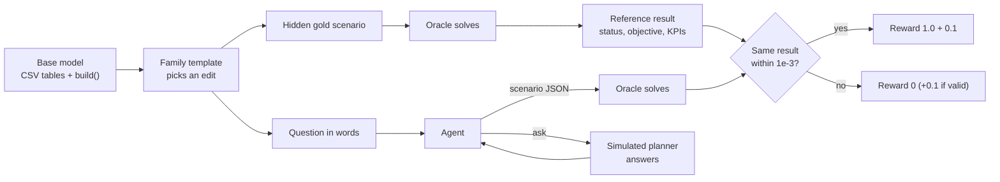
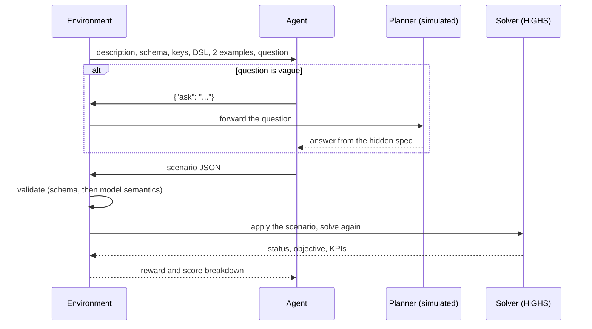
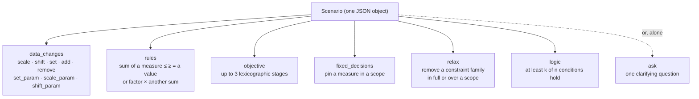
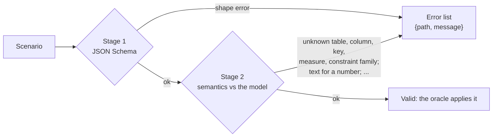
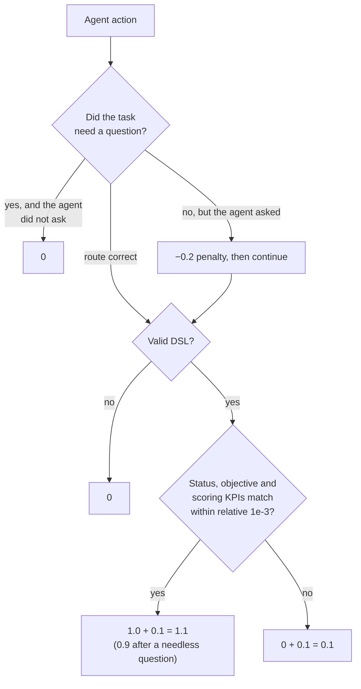
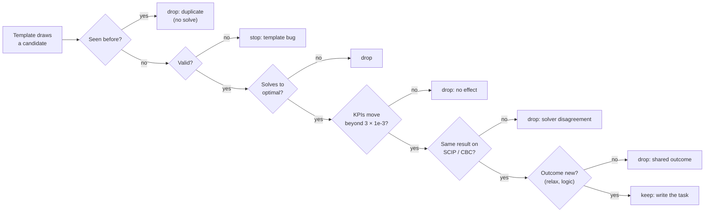
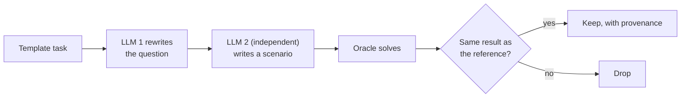
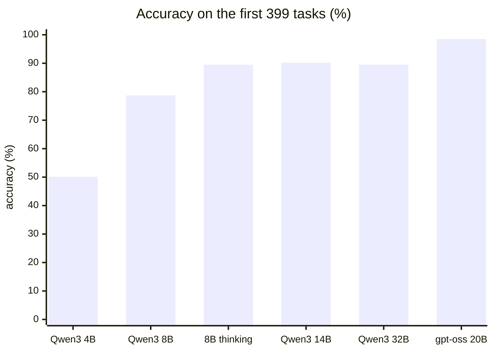
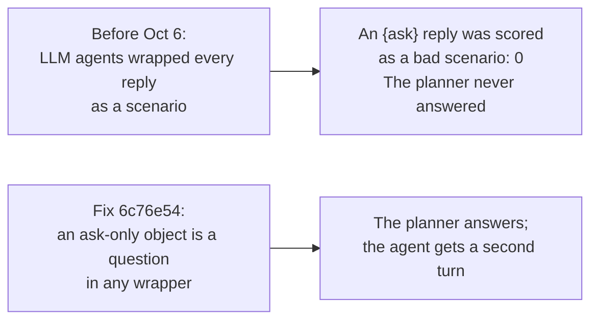
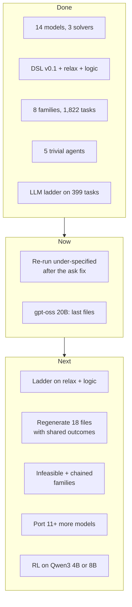

# whatifgym

**Start here:** run `./setup.sh` (about 5 minutes). It installs the solvers, runs the tests and checks every model.

whatifgym is a clean-room benchmark and reinforcement-learning environment for **LLM what-if agents over optimization models**. A planner asks a question such as *"what if demand for Prod5 drops 20 % in May?"*. The agent translates the question into a formal scenario. A solver, not the agent, solves the model again. The agent gets a reward only when the new result matches a hidden reference.

> **State on Oct 6, 2026**
>
> | Item | Now |
> |---|---|
> | Base models | 14 of 30, verified on HiGHS, SCIP and CBC |
> | Task families | 8 of 10 |
> | Tasks | 1,822 template tasks + 78 verified paraphrases |
> | Tests | 411 pass, 7 slow tests skipped |
> | Running now | The local LLM ladder runs the under-specified tasks again, after the ask fix (section 11) |

---

## Contents

1. [Quick start](#1-quick-start)
2. [How it works](#2-how-it-works)
3. [Clean-room rule](#3-clean-room-rule)
4. [Glossary](#4-glossary)
5. [Repository layout](#5-repository-layout)
6. [Base models](#6-base-models)
7. [The scenario DSL](#7-the-scenario-dsl)
8. [Oracle and scoring](#8-oracle-and-scoring)
9. [The environment](#9-the-environment)
10. [Task families and task files](#10-task-families-and-task-files)
11. [Results so far](#11-results-so-far)
12. [Run everything](#12-run-everything)
13. [Extend: new model, family or template](#13-extend-new-model-family-or-template)
14. [Conventions and known problems](#14-conventions-and-known-problems)
15. [Status and roadmap](#15-status-and-roadmap)
16. [Licence](#16-licence)

---

## 1. Quick start

Total time: about 10 minutes.

1. Get the code (1 minute):
   ```bash
   git clone https://github.com/aptgetnitin/whatifgym && cd whatifgym
   ```
2. Set up and check (about 5 minutes): `./setup.sh`, then `source .venv/bin/activate`.
3. Run the tests (about 2 minutes): `python -m pytest -q`. Expect `411 passed, 7 skipped`.
4. Score the trivial agents on one file (10 seconds):
   ```bash
   python scripts/run_baseline.py --tasks tasks/mining/new_limit_v0.jsonl --agent oracle   # mean reward 1.100
   ```
5. On Apple Silicon, install a native CBC (1 minute): `brew install cbc`. PuLP's own CBC binary is Intel-only.

---

## 2. How it works

The agent never solves anything. Its only job is to turn words into a scenario that a solver can check.



One episode, turn by turn:



The agent sees **structure, not numbers**: table keys, never table values. Thus it cannot read the answer off the data.

---

## 3. Clean-room rule

- Every model and dataset comes from **public, permissively licensed sources** (Apache-2.0, MIT, BSD).
- Every model is **rebuilt from scratch** here.
- No employer or client code, data, scenarios or names are used, now or later.
- Each model records its source, licence and reference optimum in `whatifgym/models/<name>/reference.json`.
- `ATTRIBUTION.md` lists every source with its notice. `docs/base_models.md` lists the 30-model shortlist.

---

## 4. Glossary

Each term has one meaning in this repository.

| Term | Meaning |
|---|---|
| **base model** | A `BaseModel` class in `whatifgym/models/<name>/model.py`, with `data/*.csv`, `schema.json`, `description.md` and `reference.json`. `build(data)` rebuilds the PuLP problem from the data every time. Thus a scenario is a **data edit, not a code edit**. |
| **data** | `model.load_data()`: one list of row dicts per CSV table, plus `data["params"]` (scalar parameters). This is the entire editable surface. |
| **schema** | `schema.json`: keys, column types, units, labels, parameters, measures and constraint families. Labels make the generic questions. `"editable": false` marks a structural column. `"min"`/`"max"` bound a parameter. |
| **measure** | A named family of decision variables with dimensions, for example `make[month, product]`. The DSL refers to measures, never to raw solver variables. |
| **constraint family** | A named group of constraints in the schema, for example `capacity[month, machine]`. The `relax` part of the DSL removes members of a family. |
| **KPI** | A business number from `kpis(prob, data)`. `SCORING_KPIS` lists the KPIs that are unique at the optimum; only those are scored. |
| **scenario** | One JSON object in the DSL: `data_changes`, `rules`, `objective`, `fixed_decisions`, `relax`, `logic`, or a lone `ask`. |
| **oracle** | `solve_scenario()`: validate, apply, build, solve. It makes the references and scores the agents. |
| **task** | One question with its hidden scenario, reference, split and optional `clarification`. One JSON line in `tasks/<model>/<family>_v0.jsonl`. |
| **family** | A kind of what-if: a `TaskFamily` subclass in `whatifgym/families/`. |
| **template** | One question pattern in a family: `(rng, ctx) -> (question, scenario, slots, difficulty)` or `None`. |
| **split** | `train` / `dev` / `test` (70/15/15), from a hash of the task id. A task never changes split. |
| **trivial agent** | A fixed agent that checks the reward scale or probes for leaks (section 11). |

---

## 5. Repository layout

```
whatifgym/                      the package
  base.py                       BaseModel contract, Measure, CSV loading, solve()
  solvers.py                    PuLP solvers (highs | scip | cbc), CP-SAT helpers, native-CBC detection
  registry.py                   list_models(), get_model(name)
  models/<name>/                one folder per base model (section 6)
  dsl/
    schema.json, SPEC.md        the DSL grammar and its meaning
    validate.py                 syntax, then semantics against the model
    apply.py                    apply data changes, relax, rules, fixed decisions, logic; run objective stages
    examples/01..12.json        worked examples (two go into every observation)
  oracle.py, scoring.py         solve_scenario(); compare_results() and the reward
  env.py                        WhatIfEnv: reset()/step(), ask handling, 3 turns
  tasks.py                      Task, JSONL I/O, deterministic splits
  families/                     base.py (generator and filters) + one file per family (8)
scripts/
  make_tasks.py                 generate task files
  paraphrase_tasks.py           natural-language rewrites with a round-trip check
  run_baseline.py               run one agent on one task file
  run_trivial_baselines.py      the five trivial agents on every file
  run_local_baselines.py        Ollama LLMs on every file, resumable
  summarise_results.py          comparison tables
  verify_models.py              every model x every solver vs reference.json
tasks/<model>/*.jsonl           generated tasks; tasks/frozen.txt lists files that results cite
results/                        trivial_baselines.md, baselines/ (frontier and local runs)
tests/                          pytest, 418 tests
docs/                           base_models.md (shortlist), PORTING_GUIDE.md
```

---

## 6. Base models

Fourteen public models are ported. Each one gives the published optimum on HiGHS, SCIP and CBC (`scripts/verify_models.py`). For the four newest, the original notebook was also run again on Gurobi 13.

| model | origin (data values only) | type | vars / cons / int | sense | reference optimum | measures |
|---|---|---|---|---|---|---|
| `factory_planning` | Gurobi examples, Factory Planning I | LP | 126 / 79 / 0 | max | 93 715.18 | make, store, sell |
| `factory_planning_2` | Gurobi, Factory Planning II | MILP | 156 / 84 / 30 | max | 108 855 | make, store, sell, repair |
| `food_manufacture` | Gurobi, Food Manufacture I | LP | 96 / 70 / 0 | max | 107 842.59 | buy, consume, store, produce |
| `mining` | Gurobi, Mining | MILP | 65 / 71 / 40 | max | 146 861 974.36 | extract, operate, open, blend |
| `manpower_planning` | Gurobi, Manpower Planning | LP | 72 / 30 / 0 | min | 841.80 | recruit, retrain, downgrade, redundant, … |
| `power_generation_hydro` | Gurobi, Electrical Power Generation 2 | MILP | 75 / 85 / 50 | min | 1 000 630 | ngen, output, nstart, hydro_on, … |
| `car_rental` | Gurobi, Car Rental 1 | LP | 289 / 97 / 0 | max | 121 160.21 | fleet_size, rentals, repairs, … |
| `car_rental_2` | Gurobi, Car Rental 2 | MILP | 294 / 118 / 5 | max | 132 341.47 | car_rental's + expand |
| `farm_planning` | Gurobi, Farm Planning | LP | 131 / 116 / 0 | max | 121 719.17 | herd, grow_grain, raise_heifers, … |
| `battery_scheduling` | Gurobi, Battery Scheduling | LP | 72 / 25 / 0 | max | 1.56625 | charge, discharge, soc |
| `food_supply` | Gurobi, Food Supply (WFP) | LP | 1 397 / 437 / 0 | min | 400 812 394.00 | ration, purchase, flow |
| `multiple_knapsack` | OR-Tools samples | IP | 75 / 20 / 75 | max | 395 | x |
| `bin_packing` | OR-Tools samples | IP | 132 / 22 / 132 | min | 4 | x, y |
| `wedding_seating` | PuLP case study (set partitioning) | IP | 3 213 / 18 / 3 213 | min | 12 | x |

Every model obeys one contract (`whatifgym/base.py`):

```python
class FactoryPlanning(BaseModel):
    MEASURE_DIMS = {"make": ("month", "product"), ...}  # decision measures and their dimensions
    SCORING_KPIS = ["profit", "holding_cost", "sales_contribution"]   # unique at the optimum
    def build(self, data) -> pulp.LpProblem             # rebuild from data; name constraints family_i_j
    def kpis(self, prob, data) -> dict
    def measures(self, prob) -> dict[str, Measure]
```

---

## 7. The scenario DSL

A scenario is the only thing an agent produces. Spec: `whatifgym/dsl/SPEC.md`. Grammar: `whatifgym/dsl/schema.json` (version `0.1`).



| Part | Example |
|---|---|
| `data_changes` | `{"op": "scale", "table": "max_sales", "column": "max_sales", "where": {"product": "Prod5", "month": ["May", "Jun"]}, "factor": 0.8}` |
| `rules` | `{"measure": "make", "scope": {"product": "Prod1"}, "sense": "<=", "value": 1000}` |
| `objective` | `[{"sense": "max", "measure": "original"}, {"sense": "min", "measure": "store"}]` |
| `fixed_decisions` | `{"measure": "make", "scope": {"month": "Jan", "product": "Prod3"}, "value": 100}` |
| `relax` | `{"constraint": "capacity", "scope": {"month": "Mar"}}` |
| `logic` | `{"at_least": 1, "of": [{"measure": "make", "scope": {"product": "Prod1"}, "sense": "<=", "value": 0}, {"measure": "make", "scope": {"product": "Prod1"}, "sense": ">=", "value": 300}]}` |
| `ask` | `{"version": "0.1", "ask": "Which product do you mean?"}` |

How `logic` covers what planners say:

| Planner says | `logic` |
|---|---|
| A or B | at least 1 of [A, B] |
| never both A and B | at least 1 of [not A, not B] |
| none, or at least q | at least 1 of [sum ≤ 0, sum ≥ q] |
| if A then B | at least 1 of [not A, B] |
| at most k of n | at least n − k of [x_i ≤ 0] |

The oracle adds one binary per condition. Its big-M is the exact range of the condition over the LP relaxation, so no feasible plan is cut off. A test on four models proves that each logical rule gives the best of the plain-rule branches it allows.

Validation has two stages, so every error is actionable:



`whatifgym/dsl/examples/` holds 12 valid examples. `tests/dsl_bad/` holds 26 planted bad ones; the schema must reject all of them.

---

## 8. Oracle and scoring

The scorer compares **results, never text**. Thus `scale` by 0.8 and `set` to the same numbers get the same score.



- `solve_scenario()` returns a `ScenarioResult`: status, objective, stage values, KPIs, sizes, timings and a scenario hash.
- Status values: `optimal`, `infeasible`, `unbounded`, `not_solved`, `time_limit`, `error`, `invalid`, `ask`.
- If the solve step fails on a scenario that passed validation, the episode scores as invalid. It does not stop the run.

---

## 9. The environment

`WhatIfEnv(tasks)` has `reset(task) -> obs` and `step(action) -> (obs, reward, done, info)`.

| Observation contains | Observation never contains |
|---|---|
| description, full schema, constraint families | table values |
| key values of every dimension, which rows exist | the gold scenario |
| measures and their dimensions | the reference result |
| DSL schema and 2 worked examples | |
| question, dialogue so far, turns left | |

Actions:

1. `{"type": "ask", "text": "..."}`: the simulated planner answers from the hidden spec, or says the question is clear.
2. `{"type": "scenario", "scenario": {...}}`: ends the episode; the oracle solves and the scorer compares.
3. A bare DSL object also works. **An ask-only object counts as a question, in any wrapper** (fix of Oct 6, see section 11).

An episode lasts at most 3 turns. `info` carries the full score breakdown and any validation errors.

---

## 10. Task families and task files

### How a task is made

Each candidate must pass every filter, in this order. A failed candidate is dropped and counted.



The "outcome new" filter applies to the two newest families. It stops one answer from fitting several questions.

### The ten families

| Family | Real question from the benchmark | DSL part | Status |
|---|---|---|---|
| `data_change` | "No borers are down in March after all. How much is that worth?" | `data_changes` | built |
| `new_limit` | "What if the total number of mine-years kept open may not exceed 10?" | `rules` | built |
| `relative_rule` | "Suppose at most 5% of the total units sold may go to month Mar." | `rules` + `relative_to` | built |
| `objective_change` | "Among all plans that keep profit at its maximum, pick the one with the least oil in storage." | `objective` | built |
| `fixed_decision` | "Saturday, depot Manchester gets 6 cars repaired, no more and no less. Re-plan everything else." | `fixed_decisions` | built |
| `relax_remove` | "Suppose the machine-hours limit is lifted for machine type borer only." | `relax` | built Oct 6 |
| `logical_rule` | "The tons of ore extracted at Mine4 in Year4 must be either zero or at least 7,500,000." | `logic` | built Oct 6 |
| `under_specified` | "What if the market limit for Prod7 in June changes?" Planner: "Demand for Prod7 is 40% lower in June." | `ask`, then any | built |
| infeasible request | "Serve every customer with half the fleet." | to design | not started |
| chained scenario | "On top of the previous change, cut inventory by 20%." | to design | not started |

Rules that keep the families honest:

- **data_change** adds or removes rows only in *entity* tables (items, guests, mines). It never edits a column marked `"editable": false`.
- **new_limit, relative_rule** take values from the base plan, so the new limit binds.
- **relax_remove** lifts only *policy* constraints (capacities, specifications, targets, caps), from a per-model list. Bin packing, car rental and food supply have none.
- **logical_rule** picks conditions that the base plan violates, so the rule binds.
- **under_specified** reuses a precise task and hides what is needed. A guess without a question scores 0, even when right.

### The task files

A dash means the family has nothing to say about that model.

| base model | data_change | new_limit | relative_rule | objective_change | fixed_decision | relax_remove | logical_rule | under_specified | total |
|---|---|---|---|---|---|---|---|---|---|
| `battery_scheduling` | 20 | 20 | 20 | 16 | 20 | 1 | 20 | 20 | 137 |
| `bin_packing` | 20 | 4 | 18 | – | – | – | – | 20 | 62 |
| `car_rental` | 20 | 20 | 20 | 20 | 20 | – | 20 | 20 | 140 |
| `car_rental_2` | 20 | 20 | 20 | 20 | 20 | 14 | 20 | 20 | 154 |
| `factory_planning` | 60 | 20 | 20 | 3 | 20 | 20 | 20 | 20 | 183 |
| `factory_planning_2` | 20 | 20 | 20 | 13 | 20 | 7 | 20 | 20 | 140 |
| `farm_planning` | 20 | 20 | 20 | 20 | 20 | 7 | 20 | 20 | 147 |
| `food_manufacture` | 20 | 20 | 20 | 20 | 20 | 1 | 20 | 20 | 141 |
| `food_supply` | 20 | 20 | 20 | 4 | 20 | – | 20 | 20 | 124 |
| `manpower_planning` | 20 | 20 | 20 | 20 | 20 | 12 | 20 | 20 | 152 |
| `mining` | 20 | 20 | 20 | 11 | 20 | 20 | 20 | 20 | 151 |
| `multiple_knapsack` | 20 | 15 | 20 | 1 | 15 | 1 | 18 | 20 | 110 |
| `power_generation_hydro` | 20 | 20 | 20 | 20 | 20 | – | 20 | 20 | 140 |
| `wedding_seating` | 20 | – | – | – | – | 1 | – | 20 | 41 |
| **total** | 320 | 239 | 258 | 168 | 235 | 84 | 238 | 280 | **1822** |

- Command: `python scripts/make_tasks.py --family all --model all --n 20 --seed 0`.
- The same seed gives the same file. `--force` regenerates a file.
- `tasks/frozen.txt` lists files that published results cite. `make_tasks.py` does not overwrite them without `--force-frozen`.
- Every oracle solve during generation has a 60-second limit.

### Natural-language paraphrases (`*_nl.jsonl`)

Template questions are precise but sound like a database. A paraphrase is kept only after a round trip through the solver:



Example: *"An overall cap of 55 applies to the damaged cars transferred in total."* became *"Cap damaged-car transfers at 55 in total, all days and routes combined."* The first batch has 78 rewrites, on the test split of five models: paraphraser Claude Opus, verifier Claude Sonnet, 78 of 78 accepted. Do not report results on the paraphrases for the model that verified them.

---

## 11. Results so far

### Trivial agents: the reward scale is exact

All 110 files, 1,900 tasks (`results/trivial_baselines.md`):

| Agent | What it does | Expected | Measured |
|---|---|---|---|
| `oracle` | submits the gold scenario | 1.100 (0 on under-specified) | exact on every file |
| `noop` | submits an empty valid scenario | 0.100 (0) | exact on every file |
| `ask_then_oracle` | asks one question, then the gold scenario | 0.900 (1.100) | exact on every file |
| `random_valid` | submits a random valid scenario | near 0 correct | 0.3 % correct |
| `nearest_example` | copies the gold scenario of the most similar training task | low | 6.6 % correct |

Where `nearest_example` scores high, several questions share one scored outcome. Example: lift the weight limit on *any* knapsack, and all items fit. The two newest families filter this out. 18 older files still go above 10 %; regenerate them with the same filter.

### Frontier models

On the 60 `factory_planning` data-change tasks: Claude Sonnet 59/60, Claude Opus 60/60, every answer valid DSL. This family is saturated for frontier models. It shows that the pipeline and the reward work.

### Untrained open LLMs (Ollama, M4 Max)

The first 399 tasks (`data_change` and `new_limit` on 10 base models):



- Accuracy rises fast from 4B to 14B, then stops.
- Reasoning at inference closes most of the remaining gap.
- Thus the RL target is a 4B to 8B model.

All families, accuracy (number of tasks). gpt-oss 20B is part-way through its run:

| Family | Qwen3 4B | Qwen3 8B | Qwen3 14B | gpt-oss 20B |
|---|---|---|---|---|
| data_change | 57 % (320) | 87 % (320) | 84 % (320) | 97 % (300) |
| new_limit | 41 % (239) | 67 % (239) | 91 % (239) | 98 % (239) |
| relative_rule | 26 % (258) | 60 % (258) | 81 % (258) | 92 % (98) |
| objective_change | 23 % (168) | 45 % (168) | 74 % (168) | 96 % (136) |
| fixed_decision | 28 % (235) | 46 % (235) | 91 % (235) | 100 % (140) |
| data_change, paraphrased | 42 % (33) | 79 % (33) | 88 % (33) | – |
| new_limit, paraphrased | 27 % (30) | 67 % (45) | 93 % (45) | – |

What this shows:

1. The new families are harder for small models: 23 to 28 % for Qwen3 4B.
2. Natural wording costs Qwen3 4B 14 to 15 points.
3. Qwen3 14B is the first size that stays at or above 74 % on every family.

### Asking: a correction, and the first real numbers



An earlier report said that the LLMs never asked. That was this harness bug. First-turn ask rates on the under-specified tasks, from the raw answers:

| | Qwen3 4B | Qwen3 8B | Qwen3 14B | gpt-oss 20B |
|---|---|---|---|---|
| Asked first | 25 % (71/280) | 62 % (173/280) | 43 % (121/280) | 99 % (179/180) |
| Asked when the question was clear | ≤ 2 tasks | 0 | 0 | ≤ 9 tasks |

After the fix, Qwen3 4B asked on 67 of 260 under-specified tasks, but answered only 2 correctly after the planner's reply. The other LLMs are running again now. Claude, Qwen3 32B and Qwen3 8B with thinking never asked, so their results do not change.

---

## 12. Run everything

### Tests and model checks (about 3 minutes)

```bash
python -m pytest -q                       # 411 passed, 7 skipped
python scripts/verify_models.py           # every model x every solver vs reference.json
```

### Solve a scenario and step the environment (seconds)

```python
from whatifgym.oracle import solve_scenario
from whatifgym.env import WhatIfEnv
from whatifgym.tasks import load_tasks

r = solve_scenario("factory_planning", {"version": "0.1",
    "relax": [{"constraint": "capacity", "scope": {"month": "Mar"}}]})
print(r.status, r.objective)

tasks = load_tasks("tasks/mining/new_limit_v0.jsonl", split="test")
env = WhatIfEnv(tasks)
obs = env.reset(tasks[0])
obs, reward, done, info = env.step({"type": "scenario", "scenario": {"version": "0.1", "rules": [
    {"measure": "extract", "scope": {"year": "Year3"}, "sense": "<=", "value": 1950000}]}})
```

### Generate tasks

| Goal | Command | Time |
|---|---|---|
| All missing files | `python scripts/make_tasks.py --family all --model all --n 20` | 30–60 min |
| One family, one model | `python scripts/make_tasks.py --family logical_rule --model mining --n 20 --force --check-solvers` | 1–5 min |
| A frozen file (only if you mean it) | add `--force-frozen` | – |

The script prints the split counts, the template mix and why candidates were dropped.

### Run agents

| Agent | Command |
|---|---|
| All trivial agents, all files (about 15 min) | `python scripts/run_trivial_baselines.py` |
| One trivial agent | `python scripts/run_baseline.py --tasks <file> --agent oracle` (or `noop`, `nearest_example`, `random_valid`) |
| Claude through the API | `ANTHROPIC_API_KEY=... python scripts/run_baseline.py --tasks <file> --split test --agent anthropic --model claude-sonnet-5-5` |
| Answers made elsewhere | `--export-prompts DIR`, collect one reply per task, then `--agent answers --answers-dir DIR` |
| Local LLM ladder (about one night per 4 LLMs) | `caffeinate -i python scripts/run_local_baselines.py --models qwen3:4b qwen3:8b qwen3:14b gpt-oss:20b` |

The local runner obeys these rules, because each one silently corrupted results before:

1. It sets the context window to `--num-ctx` (16,384). Ollama's default of 4,096 cuts our 4–7k-token prompts without an error.
2. JSON output mode is on. Use `--no-json-mode` to measure raw format compliance.
3. Thinking is off by default. Thinking runs get `--think-max-tokens` (8,192), because thinking tokens count against the output budget.
4. A server error on one task scores that task as wrong. It does not stop the run.
5. The run resumes: it skips every result file that exists. Stop it between files to lose no work.

Results go to `results/baselines/local/<model>/`. Raw replies go to `raw_answers/`; turns after a question go to `<task_id>.turn<k>.json`. `python scripts/summarise_results.py` builds the tables in `results/baselines/summary.md`.

---

## 13. Extend: new model, family or template

### A new base model (about half a day)

1. Port a public, permissively licensed model: numbers in `data/*.csv` and `params.csv`, the class in `model.py` (section 6).
2. Write `schema.json` with a label on every table, column, parameter, measure and constraint family. Name constraints `family_index1_index2` so `relax` can find them.
3. Record the original optimum in `reference.json`; write `description.md`.
4. Register the class in `whatifgym/registry.py`; add tests and a row in `ATTRIBUTION.md`.
5. Run `scripts/verify_models.py`, then `make_tasks.py --model <name>`. The generic templates work at once from the labels.

Full recipe: `docs/PORTING_GUIDE.md`.

### A new template (about an hour)

1. Write `(rng, ctx) -> (question, scenario, slots, difficulty) | None`.
2. Add it to the family's `specific_templates[model]` or `generic_templates`.
3. Return `None` when it does not apply. Never return an invalid scenario: generation stops on one, on purpose.
4. Name keys in the question, never values the agent cannot see.

### A new family (about a day)

1. Subclass `TaskFamily` in `whatifgym/families/`; set `name`, `description` and the templates.
2. Set `distinct_outcomes = True` and `check_all_solvers = True` for new work.
3. Add it to `FAMILIES` in `whatifgym/families/__init__.py` and to `tests/test_families.py`.

---

## 14. Conventions and known problems

### Solvers

- **Import solvers lazily.** On Linux, `highspy` and `ortools` both bundle `libhighs.so.1`; importing both in one process fails. Use PuLP solvers or CP-SAT in one process, not both.
- **PuLP is pinned to `<4`.** PuLP 4.0 changed the modelling API.
- **CBC on Apple Silicon.** PuLP's bundled CBC is Intel-only. Install `brew install cbc`; `solvers.py` uses a native `cbc` on PATH first.
- **Big-M bounds come from HiGHS.** PuLP's CBC interface fails on some changed objectives.

### Tasks and scoring

- **Compare results, never text.** Do not add text matching to the scorer.
- **Do not regenerate frozen files** silently. New generations go to new files (`--version v1`).
- **Generation is deterministic.** A candidate seen before is skipped without a solve; output does not change.
- **Score only unique KPIs.** Frequent `solver disagreement` means a listed KPI is not unique at the optimum.

### Schema and observation

- `"editable": false` keeps a column out of data changes; `"removable": false` keeps a table's rows fixed.
- `"min"`/`"max"` on a parameter bound the values that tasks may set.
- Labels are short noun phrases; questions are made from them.
- The observation shows keys, never values. Every new field must keep this.

---

## 15. Status and roadmap



| State | Item |
|---|---|
| done | 14 base models on HiGHS, SCIP and CBC; 3 also on CP-SAT; 4 also against Gurobi 13 |
| done | DSL v0.1: 12 examples, 26 planted bad scenarios, `relax` and `logic` |
| done | 8 families, 1,822 tasks, 78 verified paraphrases |
| done | Trivial agents exact on every file; probes at 0.3 % and 6.6 % |
| done | Frontier baseline (Sonnet 59/60, Opus 60/60); LLM ladder on the first 399 tasks |
| now | Under-specified re-run after the ask fix; gpt-oss 20B's last files |
| next | Ladder on `relax_remove` and `logical_rule`; frontier APIs with pinned ids |
| next | Regenerate the 18 files with shared outcomes; build the last two families |
| next | Port more models; hold some out; RL on a 4B–8B model |

---

## 16. Licence

MIT (see `LICENSE`). Ported data values are reused under their sources' licences, listed in `ATTRIBUTION.md`.
