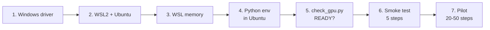

# GRPO pilot on a Windows laptop (RTX 5070 Ti, 12 GB)

**Start here:** do step 1 below (5 minutes): update the NVIDIA driver and check `nvidia-smi` in PowerShell.

Total setup: about 1 hour, most of it downloads. Then the smoke test takes about 10 minutes.



This laptop is for the **pilot**: show that the reward rises, measure memory and speed. The full runs (3 to 5 seeds, 4B and 8B) go on a rented H100 later, with the recipe in the paper plan.

---

## 1. Windows driver (5 minutes)

1. Install the latest NVIDIA Game Ready or Studio driver for the RTX 5070 Ti Laptop GPU (from nvidia.com or the NVIDIA app).
2. In PowerShell, run `nvidia-smi`. Expect the GPU name, `12227MiB` or similar, and `CUDA Version: 12.8` or higher.

Do **not** install an NVIDIA driver inside Ubuntu. WSL2 uses the Windows driver.

## 2. WSL2 and Ubuntu (15 minutes, one restart)

1. Open PowerShell **as administrator**. Run:
   ```powershell
   wsl --install -d Ubuntu-24.04
   ```
2. Restart Windows. Open "Ubuntu 24.04" from the Start menu; set a user name and password.
3. In Ubuntu, run `nvidia-smi`. Expect the same GPU as in step 1. If it fails, update the driver (step 1) and run `wsl --update` in PowerShell.

## 3. Give WSL enough memory (2 minutes)

WSL takes half of the RAM by default (16 GB). Model loading needs more.

1. In Windows, create the file `C:\Users\<you>\.wslconfig` with:
   ```ini
   [wsl2]
   memory=24GB
   swap=16GB
   processors=12
   ```
2. In PowerShell, run `wsl --shutdown`. Open Ubuntu again.

## 4. Python environment in Ubuntu (20–30 minutes, downloads)

Run these in Ubuntu. Keep the repository in the Linux file system (`~/`), not under `/mnt/c/`: file access there is many times slower.

1. Tools:
   ```bash
   sudo apt update && sudo apt install -y git python3.12-venv python3-dev build-essential
   ```
2. Code. Push and pull only with your personal GitHub account (clean-room rule 7):
   ```bash
   git clone https://github.com/aptgetnitin/whatifgym ~/whatifgym && cd ~/whatifgym
   python3.12 -m venv .venv-train && source .venv-train/bin/activate
   ```
3. PyTorch for CUDA 12.8 first (the RTX 50 series needs it), then the rest:
   ```bash
   pip install --upgrade pip
   pip install torch --index-url https://download.pytorch.org/whl/cu128
   pip install -r requirements.txt -r training/requirements.txt
   ```
4. Record the versions, for the paper's compute report:
   ```bash
   pip freeze > training/env-lock.txt
   ```

If `pip install` of `unsloth` or `vllm` replaces PyTorch with a build that has no `sm_120`, step 5 says so. Then follow Unsloth's guide for Blackwell / RTX 50-series GPUs (docs.unsloth.ai) and run step 5 again.

## 5. Check the GPU (1 minute)

```bash
python training/check_gpu.py
```

Expect: compute capability **12.0**, about **12 GB**, `matmul ok`, every library listed, and `READY` at the end.

## 6. Smoke test (about 10 minutes, the first time longer: it downloads the model, about 3 GB)

Plug in the charger and set Windows to "Best performance".

```bash
python training/grpo_pilot.py --smoke
```

It runs 5 GRPO steps on 20 training tasks, then prints a summary. Send me `results/training/pilot/summary.json`:

| Field | What it tells us |
|---|---|
| `peak_gpu_memory_gb` | how close to 12 GB we are |
| `seconds_per_step` | the speed; a 50-step pilot takes 50 × this |
| `reward_seconds_per_step` | the time the solver takes; it must stay small |
| `reward_by_step` | the reward per step (5 steps are too few to show learning) |
| `dropped_config_options` | options this TRL version does not have |

**If it runs out of memory** ("CUDA out of memory"), try these in order, one at a time:

1. `--gpu-mem 0.45`: less memory for generation.
2. `--max-prompt-tokens 5500`: drops the longest prompts.
3. `--num-generations 2 --grad-accum 4`: a smaller group per step.
4. `--max-completion 512`: shorter answers.

## 7. The pilot (2–6 hours, depending on step 6)

```bash
python training/grpo_pilot.py --max-steps 50
```

Done when the reward rises over the 50 steps and `reward_seconds_per_step` stays under a quarter of `seconds_per_step` (paper plan, Phase 4).

---

## What the pilot does, and does not do

| | Pilot (this laptop) | Full runs (H100, later) |
|---|---|---|
| Model | Qwen3-4B-Instruct-2507, 4-bit + LoRA rank 32 | Qwen3-8B and 4B, bf16 + LoRA |
| Group size | 4 | 8–16 |
| Prompts | up to 7,000 tokens: 863 tasks, 9 families, 9 base models | all |
| Turns | one; `under_specified` left out | multi-turn, with the ask action |
| Reward | the environment's: 1.1 correct, 0.1 valid only, 0 otherwise | the same |

The pilot uses the exact prompt of the baselines (`scripts/run_baseline.py`), so a trained adapter is measured the same way as the untrained models.

Outputs go to `results/training/pilot/` (git-ignored): the LoRA adapter, `log_history.json`, `summary.json`.
